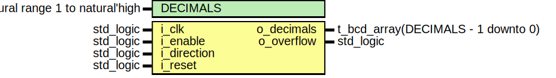
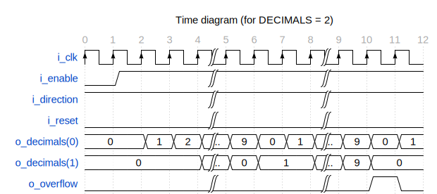

# Entity: bcd_counter 
- **File**: bcd_counter.vhd

## Diagram

## Description

BCD counter with generic number of decimal digits.

 

## Generics

| Generic name | Type                            | Value | Description              |
| ------------ | ------------------------------- | ----- | ------------------------ |
| DECIMALS     | natural range 1 to natural'high | 2     | number of decimal digits |

## Ports

| Port name   | Direction | Type                               | Description                                                                                             |
| ----------- | --------- | ---------------------------------- | ------------------------------------------------------------------------------------------------------- |
| i_clk       | in        | std_logic                          | input clock                                                                                             |
| i_enable    | in        | std_logic                          | enable (is lower priority than reset)                                                                   |
| i_direction | in        | std_logic                          | count up (1) or down (0)                                                                                |
| i_reset     | in        | std_logic                          | reset (has priority over enable)                                                                        |
| o_decimals  | out       | t_bcd_array(DECIMALS - 1 downto 0) | output digits, index 0 is the least significant                                                         |
| o_overflow  | out       | std_logic                          | overflow flag, active when most significant digit overflows (counting up) or underflows (counting down) |

## Processes
- proc_clk: ( i_clk )

## Assertions

| Label | Condition |
|-------|-----------|
| decimals_reset | always i_reset -> next (o_decimals(0) = 0 and o_decimals(1) = 0) |
| decimals_max_value | always (o_decimals(0) <= 9 and o_decimals(1) <= 9) |
| decimals_count_up | always (not i_reset and i_enable and i_direction and count /= 99) -> next (count = prev(count) + 1) |
| decimals_count_up_overflow | always (not i_reset and i_enable and i_direction and count = 99) -> next (count = 0) |
| decimals_count_down | always (not i_reset and i_enable and not i_direction and count /= 0) -> next (count = prev(count) - 1) |
| decimals_count_down_overflow | always (not i_reset and i_enable and not i_direction and count = 0) -> next (count = 99) |
| decimals_disabled | always (not i_reset and not i_enable) -> next (count = prev(count)) |
| overflow_reset | always (i_reset) -> next (not o_overflow) |
| overflow_count_up | always (not i_reset and i_enable and i_direction and count = 99) -> next (o_overflow) |
| overflow_count_up_inactive | always (not i_reset and i_enable and i_direction and count /= 99) -> next (not o_overflow) |
| overflow_count_down | always (not i_reset and i_enable and not i_direction and count = 0) -> next (o_overflow) |
| overflow_count_down_inactive | always (not i_reset and i_enable and not i_direction and count /= 0) -> next (not o_overflow) |
