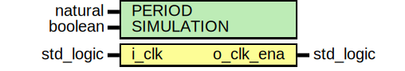
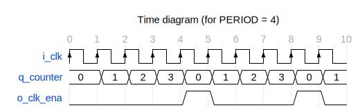

# Entity: clock_enable_generator 
- **File**: clock_enable_generator.vhd

## Diagram

## Description

Parametrized clock enable pulse generator.

The initial value of output `o_clk_ena` is '0'.

 

## Generics

| Generic name | Type                            | Value | Description                                                             |
| ------------ | ------------------------------- | ----- | ----------------------------------------------------------------------- |
| PERIOD       | natural range 1 to natural'high | 10    | number of clock cycles required to generate a single clock enable pulse |

## Ports

| Port name | Direction | Type      | Description                                                |
| --------- | --------- | --------- | ---------------------------------------------------------- |
| i_clk     | in        | std_logic | input clock                                                |
| o_clk_ena | out       | std_logic | clock enable signal, active high for one input clock cycle |

## Signals

| Name      | Type                                 | Description      |
| --------- | ------------------------------------ | ---------------- |
| q_counter | unsigned(COUNTER_WIDTH - 1 downto 0) | counter register |

## Constants

| Name          | Type    | Value                    | Description                            |
| ------------- | ------- | ------------------------ | -------------------------------------- |
| COUNTER_WIDTH | natural | get_binary_width(PERIOD) | counter width required to fit `PERIOD` |

## Processes
- proc_clk_ena: ( i_clk )

## Assertions

| Label | Condition |
|-------|-----------|
| q_counter_increment | always (q_counter < (PERIOD - 1)) -> next (q_counter = prev(q_counter) + 1) |
| o_clk_ena_period | always (q_counter = (PERIOD - 1)) -> next (o_clk_ena) |
| q_counter_reset | always (q_counter = (PERIOD - 1)) -> next (q_counter = 0) |
| o_clk_ena_one_cycle | always (o_clk_ena) -> next (not o_clk_ena) |
