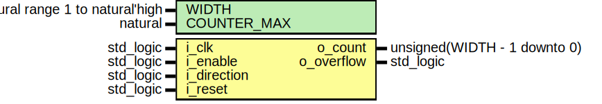

# Entity: counter 
- **File**: counter.vhd

## Diagram

## Description

Simple unsigned parametrized counter.

## Generics

| Generic name | Type                            | Value | Description              |
| ------------ | ------------------------------- | ----- | ------------------------ |
| WIDTH        | natural range 1 to natural'high | 4     | number of decimal digits |

## Ports

| Port name   | Direction | Type                         | Description                                                                              |
| ----------- | --------- | ---------------------------- | ---------------------------------------------------------------------------------------- |
| i_clk       | in        | std_logic                    | input clock                                                                              |
| i_enable    | in        | std_logic                    | enable (is lower priority than reset)                                                    |
| i_direction | in        | std_logic                    | count up (1) or down (0)                                                                 |
| i_reset     | in        | std_logic                    | reset (has priority over enable)                                                         |
| o_count     | out       | unsigned(WIDTH - 1 downto 0) | output digits, index 0 is the least significant                                          |
| o_overflow  | out       | std_logic                    | overflow flag, active when counter overflows (counting up) or underflows (counting down) |

## Constants

| Name        | Type    | Value                   | Description              |
| ----------- | ------- | ----------------------- | ------------------------ |
| COUNTER_MAX | natural | 2 ** o_count'length - 1 | maximum value of counter |

## Processes
- proc_clk: ( i_clk )

## Assertions

| Label | Condition |
|-------|-----------|
| count_reset | always i_reset -> next (o_count = 0) |
| count_up | always (not i_reset and i_enable and i_direction and o_count /= COUNTER_MAX) -> next (o_count = prev(o_count) + 1) |
| count_up_overflow | always (not i_reset and i_enable and i_direction and o_count = COUNTER_MAX) -> next (o_count = 0) |
| count_down | always (not i_reset and i_enable and not i_direction and o_count /= 0) -> next (o_count = prev(o_count) - 1) |
| count_down_overflow | always (not i_reset and i_enable and not i_direction and o_count = 0) -> next (o_count = COUNTER_MAX) |
| count_disabled | always (not i_reset and not i_enable) -> next (o_count = prev(o_count)) |
| overflow_reset | always (i_reset) -> next (not o_overflow) |
| overflow_count_up | always (not i_reset and i_enable and i_direction and o_count = COUNTER_MAX) -> next (o_overflow) |
| overflow_count_up_inactive | always (not i_reset and i_enable and i_direction and o_count /= COUNTER_MAX) -> next (not o_overflow) |
| overflow_count_down | always (not i_reset and i_enable and not i_direction and o_count = 0) -> next (o_overflow) |
| overflow_count_down_inactive | always (not i_reset and i_enable and not i_direction and o_count /= 0) -> next (not o_overflow) |
