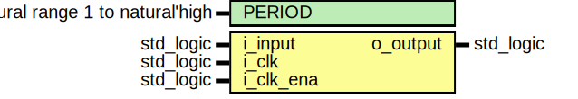

# Entity: debouncer 
- **File**: debouncer.vhd

## Diagram

## Description

Parametrized debouncer.

The `i_input` signal can be asynchronous, as the debouncer includes a 2-stage flip-flop synchronizer.

The `o_output` signal reacts to `i_input` after it is stable for `PERIOD` `i_clk_ena` cycles.
The initial value of `o_output` is '0'.

There is a latency of 4 `i_clk` cycles (2 cycles for the flip-flop synchronizer,
1 cycle for counter reset XOR, 1 cycle for the output register) and up to 1 `i_clk_ena`
cycle (depending on when `i_input` changes).

 

## Generics

| Generic name | Type    | Value | Description                                                        |
| ------------ | ------- | ----- | ------------------------------------------------------------------ |
| PERIOD       | natural | 10    | number of `i_clk_ena` cycles during which `i_input` must be stable |
| SIMULATION   | boolean | true  | generate simulation asserts                                        |

## Ports

| Port name | Direction | Type      | Description                                                 |
| --------- | --------- | --------- | ----------------------------------------------------------- |
| i_input   | in        | std_logic | input signal to be debounced                                |
| i_clk     | in        | std_logic | input clock                                                 |
| i_clk_ena | in        | std_logic | clock enable signal, used for incrementing internal counter |
| o_output  | out       | std_logic | debounced output                                            |

## Signals

| Name             | Type                                 | Description            |
| ---------------- | ------------------------------------ | ---------------------- |
| q_counter        | unsigned(COUNTER_WIDTH - 1 downto 0) | counter register       |
| input_sync       | std_logic                            | synchronized `i_input` |
| q_input_sync_dly | std_logic                            | delayed `input_sync`   |

## Constants

| Name          | Type    | Value                                 | Description                                                                                 |
| ------------- | ------- | ------------------------------------- | ------------------------------------------------------------------------------------------- |
| COUNTER_WIDTH | natural | natural(ceil(log2(real(PERIOD + 1)))) | counter width required to fit `PERIOD` + 1 (+1 because value 0 can last unpredictably long) |

## Processes
- proc_clk: ( i_clk )

## Instantiations

- inst_synchronizer: work.flip_flop_synchronizer

## Assertions

| Label | Condition | Report | Severity | File |
|-------|-----------|--------|----------| -----|
| counter_max_min_value | PERIOD > 1 | `PERIOD` must be larger than 1 | error | .vhd |
