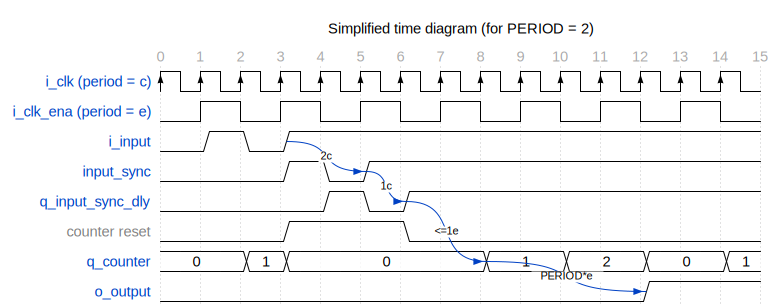

# Entity: debouncer 
- **File**: debouncer.vhd

## Diagram

## Description

Parametrized debouncer.

The `i_input` signal can be asynchronous, as the debouncer includes a 2-stage flip-flop synchronizer.

The `o_output` signal reacts to `i_input` after it is stable for `PERIOD` `i_clk_ena` cycles.
The initial value of `o_output` is '0'.

There is a total latency of 3 `i_clk` cycles (2 cycles for the flip-flop synchronizer and
1 cycle for counter reset XOR) and the period during which stability of
`i_input` is required is actually from `PERIOD` to `PERIOD + 1` `i_clk_ena` cycles, depending on the instant
when `i_input` changes (this is why the counter final value is `PERIOD` and not `PERIOD - 1`).

 

## Generics

| Generic name | Type                            | Value | Description                                                        |
| ------------ | ------------------------------- | ----- | ------------------------------------------------------------------ |
| PERIOD       | natural range 1 to natural'high | 10    | number of `i_clk_ena` cycles during which `i_input` must be stable |
| SIMULATION   | boolean                         | true  | generate simulation asserts                                        |

## Ports

| Port name | Direction | Type      | Description                                                 |
| --------- | --------- | --------- | ----------------------------------------------------------- |
| i_input   | in        | std_logic | input signal to be debounced                                |
| i_clk     | in        | std_logic | input clock                                                 |
| i_clk_ena | in        | std_logic | clock enable signal, used for incrementing internal counter |
| o_output  | out       | std_logic | debounced output                                            |

## Signals

| Name             | Type                                 | Description            |
| ---------------- | ------------------------------------ | ---------------------- |
| q_counter        | unsigned(COUNTER_WIDTH - 1 downto 0) | counter register       |
| input_sync       | std_logic                            | synchronized `i_input` |
| q_input_sync_dly | std_logic                            | delayed `input_sync`   |

## Constants

| Name          | Type    | Value                                 | Description                                |
| ------------- | ------- | ------------------------------------- | ------------------------------------------ |
| COUNTER_WIDTH | natural | natural(ceil(log2(real(PERIOD + 1)))) | counter width required to fit `PERIOD` + 1 |

## Processes
- proc_clk: ( i_clk )

## Instantiations

- inst_synchronizer: work.flip_flop_synchronizer

## Covers

| Label | Condition |
|-----------|-----------|
| cover_output_toggle | (o_output = '0')[+]; (o_output = '1')[+]; (o_output = '0')[+] |
| cover_input_toggle | (i_input = '0'); (i_input = '1'); (i_input = '0'); (i_input = '1')[*2 to inf]; (o_output = '1') |

## Assumptions

| Condition |
|-----------|
| always (i_clk_ena) -> next (not i_clk_ena) |

## Assertions

| Label | Condition |
|-------|-----------|
| counter_stable_disabled | always (not i_clk_ena and input_sync = q_input_sync_dly) -> next (stable(q_counter)) |
| counter_increments_when_input_stable | always (input_sync = q_input_sync_dly and i_clk_ena and q_counter /= PERIOD) -> next (q_counter = prev(q_counter) + 1) |
| output_stable_before_period | always (q_counter /= PERIOD) -> next (stable(o_output)) |
| q_counter_resets_on_input_change | always (input_sync /= q_input_sync_dly) -> next (q_counter = 0) |
| q_counter_resets_after_period | always (q_counter = PERIOD and i_clk_ena and input_sync = q_input_sync_dly) -> next (q_counter = 0) |
| o_output_updates_value | always (q_counter = PERIOD and i_clk_ena and input_sync = q_input_sync_dly) -> next (o_output = input_sync) abort (input_sync /= q_input_sync_dly) |
