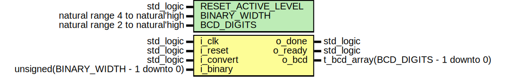

# Entity: double_dabble 
- **File**: double_dabble.vhd

## Diagram

## Description

Parametrized unsigned to BCD converter, utilizing double-dabble algorithm.

The number of clocks required from `i_convert` = '1' to `o_done` = '1' is `BINARY_WIDTH - 1`, where
`BINARY_WIDTH` is the width of binary input. One cycle is used to load binary data into shift registers
and `BINARY_WIDTH - 2` cycles are used to convert the data.

Note that `o_bcd` data changes during conversion and the data are valid only when `o_done` is high. If invalid data
are not permissible, the output data should be registered and updated only when `o_done` is high. Technically the
output data is also valid in the first cycle after `o_done` goes low, since in that cycle new input data is loaded
into shift registers.

Note that the input data is registered in shift registers in `S_LOAD_SHIFTREG` state, which occurs one clock after
`i_convert` goes high. This means that the converted number is not necessarily same as the number in `i_binary`
when `i_convert` goes high, but rather that is present on `i_binary` in the next clock after `i_convert` goes high.

The output `o_ready` goes low when new conversion starts and goes high when conversion is done, at the same time as
`o_done`. The output `o_ready` is always high when `i_reset` is active, but the conversion only starts when`o_ready`
is high and `i_convert` is high when `i_reset` is inactive.

## Generics

| Generic name       | Type                            | Value | Description                 |
| ------------------ | ------------------------------- | ----- | --------------------------- |
| RESET_ACTIVE_LEVEL | std_logic                       | '1'   | Active level of `i_reset`   |
| BINARY_WIDTH       | natural range 4 to natural'high | 6     | Width of binary input       |
| BCD_DIGITS         | natural range 2 to natural'high | 2     | Number of output BCD digits |

## Ports

| Port name | Direction | Type                                 | Description                                                                       |
| --------- | --------- | ------------------------------------ | --------------------------------------------------------------------------------- |
| i_clk     | in        | std_logic                            | System clock                                                                      |
| i_reset   | in        | std_logic                            | Synchronous reset                                                                 |
| i_convert | in        | std_logic                            | Starts conversion when high and `o_ready` is high                                 |
| i_binary  | in        | unsigned(BINARY_WIDTH - 1 downto 0)  | Binary data to convert                                                            |
| o_done    | out       | std_logic                            | High when conversion is done and data are valid                                   |
| o_ready   | out       | std_logic                            | When low, a conversion is under way                                               |
| o_bcd     | out       | t_bcd_array(BCD_DIGITS - 1 downto 0) | Output data, valid only when `o_done` is high, static until new conversion starts |

## Signals

| Name            | Type                                       | Description                |
| --------------- | ------------------------------------------ | -------------------------- |
| current_state   | fsm_state                                  | FSM current state signal   |
| binary_shiftreg | unsigned(i_binary'length - 3 - 1 downto 0) | Binary shift register      |
| bcd_shiftreg    | unsigned(BCD_DIGITS * 4 - 1 downto 0)      | BCD shift register         |
| bit_count       | unsigned(COUNTER_SIZE - 1 downto 0)        | Conversion cycle counter   |
| load_shiftregs  | std_logic                                  | Shift register load signal |
| run_algorithm   | std_logic                                  | Run algorithm signal       |

## Constants

| Name          | Type                                | Value                                                                    | Description                      |
| ------------- | ----------------------------------- | ------------------------------------------------------------------------ | -------------------------------- |
| MAX_COUNT     | natural                             | maximum(i_binary'length - 3 - 1,  0)  | Number of conversion cycles      |
| COUNTER_SIZE  | natural                             | get_binary_width(MAX_COUNT)                                              | Size of conversion cycle counter |
| INITIAL_COUNT | unsigned(COUNTER_SIZE - 1 downto 0) | to_unsigned(MAX_COUNT,  COUNTER_SIZE) | Initial value of counter         |

## Enums

### *fsm_state*
| Name            | Description                                |
| --------------- | ------------------------------------------ |
| S_IDLE          | Idle, waiting for `i_convert` active pulse |
| S_LOAD_SHIFTREG | Load shift registers with input data       |
| S_CONVERTING    | Conversion under way                       |
| S_DONE          | Conversion done, output data are valid     |

## Processes
- proc_double_dabble: ( i_clk )
- proc_fsm: ( i_clk )
- proc_bit_counter: ( i_clk )

## Assertions

| Label | Condition |
|-------|-----------|
| output_correct | always (o_done) -> (result = q_binary) abort (i_reset = RESET_ACTIVE_LEVEL) |
| reset | always (i_reset = RESET_ACTIVE_LEVEL) -> next (not o_done and o_ready and result = 0) |
| ready_done_deactivation | always (not i_reset and i_convert and o_ready) -> next (not o_ready and not o_done) |
| conversion | always {not i_reset and i_convert and o_ready} &#124;=> {not o_ready and not o_done[*4]; o_ready and o_done} abort (i_reset = RESET_ACTIVE_LEVEL) |
| never_done_not_ready | never (o_done and not o_ready) |
