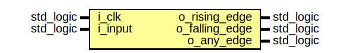
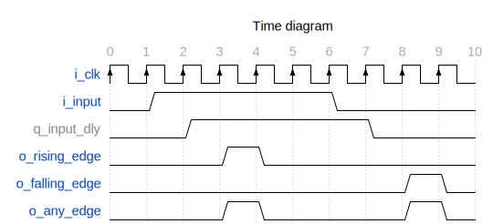

# Entity: edge_detector 
- **File**: edge_detector.vhd

## Diagram

## Description

Synchronous edge detector.

Warning: After reset there might be a false rising edge detected if `i_input` is high
from the very start, as the delayed input is initialized to '0'.

 

## Ports

| Port name      | Direction | Type      | Description                           |
| -------------- | --------- | --------- | ------------------------------------- |
| i_clk          | in        | std_logic | input clock                           |
| i_input        | in        | std_logic | input signal                          |
| o_rising_edge  | out       | std_logic | high when input goes from low to high |
| o_falling_edge | out       | std_logic | high when input goes from high to low |
| o_any_edge     | out       | std_logic | high when input changes               |

## Signals

| Name        | Type      | Description   |
| ----------- | --------- | ------------- |
| q_input_dly | std_logic | delayed input |

## Processes
- proc_clk: ( i_clk )

## Assertions

| Label | Condition |
|-------|-----------|
| input_rising_edge | always {not i_input; i_input} &#124;=> {o_rising_edge and o_any_edge and not o_falling_edge} |
| input_falling_edge | always {i_input; not i_input} &#124;=> {o_falling_edge and o_any_edge and not o_rising_edge} |
| input_high | always {i_input[*2]} &#124;=> {not o_any_edge and not o_rising_edge and not o_falling_edge} |
| input_low | always {not i_input[*2]} &#124;=> {not o_any_edge and not o_rising_edge and not o_falling_edge} |
