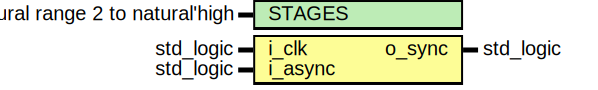
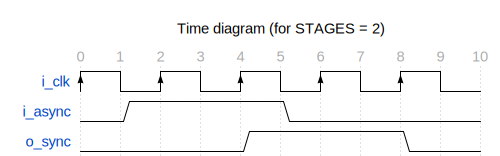

# Entity: flip_flop_synchronizer 
- **File**: flip_flop_synchronizer.vhd

## Diagram

## Description

Parametrized flip-flop synchronizer.

The initial value of output `o_sync` is '0'.

 

## Generics

| Generic name | Type    | Value | Description                                 |
| ------------ | ------- | ----- | ------------------------------------------- |
| STAGES       | natural | 2     | number of chained flip-flops                |
| SIMULATION   | boolean | true  | generate logic needed for assert evaluation |

## Ports

| Port name | Direction | Type      | Description        |
| --------- | --------- | --------- | ------------------ |
| i_clk     | in        | std_logic | input clock        |
| i_async   | in        | std_logic | asynchronous input |
| o_sync    | out       | std_logic | synchronous output |

## Signals

| Name  | Type                                  | Description             |
| ----- | ------------------------------------- | ----------------------- |
| q_reg | std_logic_vector(STAGES - 1 downto 0) | internal shift register |

## Processes
- proc_sync: ( i_clk )

## Assertions

| Label | Condition | Report | Severity |
|-------|-----------|--------|----------|
| stages_min_value | STAGES > 1 | `STAGES` must be larger than 1 | error |
