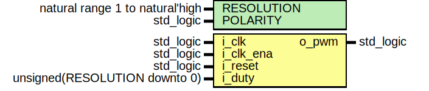

# Entity: pwm_generator 
- **File**: pwm_generator.vhd

## Diagram

## Description

Parametrized PWM signal generator.

The initial value of output `o_pwm` is `not POLARITY`. If `i_duty = 0`, then `o_pwm` is `not POLARITY`.
If `i_duty = 1`, then `o_pwm` is `POLARITY`. If `i_duty` is not 0 or 1, then in the first phase of the PWM
waveform the output is `POLARITY`.

The resolution of duty cycle is `1/(2^RESOLUTION)`. For example, if `RESOLUTION = 2`,
then the duty cycle resolution is 1/4 and there are 5 possible duty cycle values:
0, 1/4, 1/2, 3/4, 1.

The frequency of the output PWM signal is `f_clk_ena/(2^RESOLUTION)`.

The input `i_duty` is the desired duty cycle value. For example, if `i_duty = 3` and `RESOLUTION = 2`,
then the duty cycle is 3/4. The width of `i_duty` is `RESOLUTION + 1`, not `RESOLUTION`, as the extra bit
is needed to allow 100% duty cycle. Any `i_duty` value greater than `2^RESOLUTION - 1` is treated as 100%
duty cycle.

The input `i_duty` is registered if `i_reset` is active or if `i_clk_ena` is active and the internal counter
is at its maximum value, i.e. at the end of the PWM period. During the PWM period the registered duty does not
change.

The input `i_reset` is a synchronous reset. While active, it forces output to initial value, internal counter to
zero and registers the `i_duty` input.

## Generics

| Generic name | Type                            | Value | Description                               |
| ------------ | ------------------------------- | ----- | ----------------------------------------- |
| RESOLUTION   | natural range 1 to natural'high | 2     | duty cycle resolution is 1/(2^RESOLUTION) |
| POLARITY     | std_logic                       | '1'   | output active polarity                    |

## Ports

| Port name | Direction | Type                          | Description                           |
| --------- | --------- | ----------------------------- | ------------------------------------- |
| i_clk     | in        | std_logic                     | input clock                           |
| i_clk_ena | in        | std_logic                     | clock enable                          |
| i_reset   | in        | std_logic                     | reset signal                          |
| i_duty    | in        | unsigned(RESOLUTION downto 0) | PWM duty (i_pwm_value / 2^RESOLUTION) |
| o_pwm     | out       | std_logic                     | PWM output                            |

## Signals

| Name      | Type                              | Description           |
| --------- | --------------------------------- | --------------------- |
| q_counter | unsigned(RESOLUTION - 1 downto 0) | counter               |
| q_duty    | unsigned(RESOLUTION downto 0)     | registered duty input |

## Constants

| Name        | Type    | Value                     | Description              |
| ----------- | ------- | ------------------------- | ------------------------ |
| COUNTER_MAX | natural | 2 ** q_counter'length - 1 | maximum value of counter |

## Processes
- proc_pwm: ( i_clk )

## Covers

| Label | Condition |
|-----------|-----------|
| cover_output_toggle | (o_pwm = '0')[+]; (o_pwm = '1')[+]; (o_pwm = '0')[+] |

## Assumptions

| Condition |
|-----------|
| always (i_clk_ena) -> next (not i_clk_ena) |

## Assertions

| Label | Condition |
|-------|-----------|
| o_pwm_reset | always (i_reset) -> next (o_pwm = not POLARITY) |
| q_counter_reset | always (i_reset) -> next (q_counter = 0) |
| q_duty_reset | always (i_reset) -> next (q_duty = prev(i_duty)) |
| q_counter_increment | always (i_clk_ena and not i_reset and q_counter < COUNTER_MAX) -> next (q_counter = prev(q_counter) + 1) abort (i_reset) |
| q_counter_overflow | always (i_clk_ena and not i_reset and q_counter = COUNTER_MAX) -> next (q_counter = 0) |
| q_counter_stable | always (not i_reset and not i_clk_ena) -> next (stable(q_counter)) |
| q_duty_update | always (i_clk_ena and not i_reset and q_counter = COUNTER_MAX) -> next (q_duty = prev(i_duty)) |
| q_duty_stable | always (not i_reset and q_counter /= COUNTER_MAX) -> next (stable(q_duty)) |
| o_pwm_active | always (i_clk_ena and not i_reset and q_duty > 0 and q_counter < (q_duty - 1) and q_counter /= COUNTER_MAX) -> next (o_pwm = POLARITY) abort (i_reset) |
| o_pwm_inactive | always (i_clk_ena and not i_reset and q_counter >= q_duty and q_counter /= COUNTER_MAX) -> next (o_pwm = not POLARITY) abort (i_reset) |
