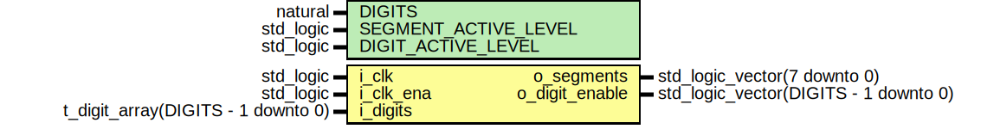
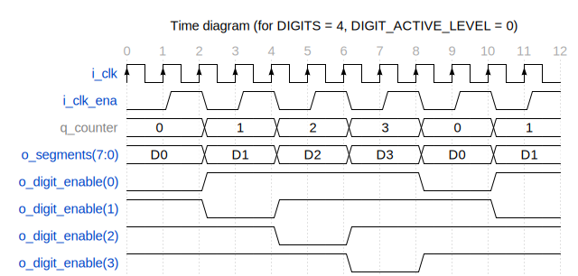

# Entity: seven_segment_controller 
- **File**: seven_segment_controller.vhd

## Diagram

## Description

Parametrized seven segment display controller.

On Nexys A7 board, both cathodes (segments) and anodes (common)
are active low.

 

## Generics

| Generic name         | Type      | Value | Description              |
| -------------------- | --------- | ----- | ------------------------ |
| DIGITS               | natural   | 2     | number of digits         |
| SEGMENT_ACTIVE_LEVEL | std_logic | '0'   | active level of segments |
| DIGIT_ACTIVE_LEVEL   | std_logic | '0'   | active level of anodes   |

## Ports

| Port name      | Direction | Type                                  | Description                                                       |
| -------------- | --------- | ------------------------------------- | ----------------------------------------------------------------- |
| i_clk          | in        | std_logic                             | input clock                                                       |
| i_clk_ena      | in        | std_logic                             | clock enable signal, each digit is active for 1 `i_clk_ena` cycle |
| i_digits       | in        | t_digit_array(DIGITS - 1 downto 0)    | array of digit records                                            |
| o_segments     | out       | std_logic_vector(7 downto 0)          | output segments (7: CA, ..., 1: CG, 0: DP)                        |
| o_digit_enable | out       | std_logic_vector(DIGITS - 1 downto 0) | output digit common anodes                                        |

## Signals

| Name      | Type                         | Description                                             |
| --------- | ---------------------------- | ------------------------------------------------------- |
| q_counter | integer                      | internal counter                                        |
| segments  | std_logic_vector(7 downto 0) | intermediary signal for controlling individual segments |

## Constants

| Name           | Type                     | Value                                                                                                                                                                                                                                                                                                                                                                                                                                                                                                                                                                                                                                                                                                                                                                                                                                                                                                                                                                                | Description                                                                        |
| -------------- | ------------------------ | ------------------------------------------------------------------------------------------------------------------------------------------------------------------------------------------------------------------------------------------------------------------------------------------------------------------------------------------------------------------------------------------------------------------------------------------------------------------------------------------------------------------------------------------------------------------------------------------------------------------------------------------------------------------------------------------------------------------------------------------------------------------------------------------------------------------------------------------------------------------------------------------------------------------------------------------------------------------------------------ | ---------------------------------------------------------------------------------- |
| SEGMENTS_ARRAY | t_segment_array(0 to 15) | (          "1111110",  -- 0          "0110000",  -- 1          "1101101",  -- 2          "1111001",  -- 3          "0110011",  -- 4          "1011011",  -- 5          "1011111",  -- 6          "1110000",  -- 7          "1111111",  -- 8          "1111011",  -- 9          "1110111",  -- A          "0011111",  -- B          "1001110",  -- C          "0111101",  -- D          "1001111",  -- E          "1000111"  -- F      ) | array of predefined segment patterns, assumes active level is '1', DP not included |

## Types

| Name            | Type                                                     | Description |
| --------------- | -------------------------------------------------------- | ----------- |
| t_segment_array | array (natural range <>) of std_logic_vector(6 downto 0) |             |

## Processes
- proc_clk: ( i_clk )

## Assumptions

| Condition |
|-----------|
| always i_clk_ena -> next not i_clk_ena |

## Assertions

| Label | Condition |
|-------|-----------|
| q_counter_increment | always (i_clk_ena and q_counter /= (DIGITS - 1)) -> next (q_counter = prev(q_counter) + 1) |
| q_counter_overflow | always (i_clk_ena and q_counter = (DIGITS - 1)) -> next (q_counter = 0) |
| o_digit_enable_active | always (o_digit_enable(q_counter) = DIGIT_ACTIVE_LEVEL) |
| o_digit_enable_inactive | always (i /= q_counter) -> (o_digit_enable(i) = not DIGIT_ACTIVE_LEVEL) |
| o_segments_inactive | always (not i_digits(q_counter).enable) -> (o_segments = SEGMENTS_INACTIVE) |
| o_segments_active | always (i_digits(q_counter).enable) -> (segments(7 downto 1) = SEGMENTS_ARRAY(to_integer(i_digits(q_counter).value)) and segments(0) = i_digits(q_counter).decimal_point) |
