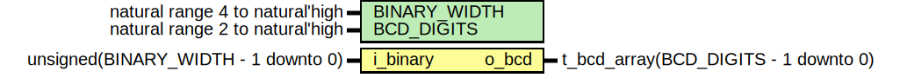

# Entity: unsigned_to_bcd_lut 
- **File**: unsigned_to_bcd_lut.vhd

## Diagram

## Description

Parametrized unsigned to BCD converter, utilizing combinational logic.

The following table summarizes the resources used by this module according to Yosys.

| BINARY_WIDTH | BCD_DIGITS | Cells (Yosys `prep`) | Cells (Xilinx XC7) |
|--------------|------------|------------------------|------------------|
| 4            | 2          | 12 | 19 |
| 5            | 2          | 18 | 47 |
| 6            | 2          | 24 | 55 |
| 7            | 3          | 39 | 80 |
| 8            | 3          | 48 | 98 |
| 9            | 3          | 57 | 126 |
| 10           | 4          | 81 | 152 |
| 14           | 5          | 153 | 299 |
| 17           | 6          | 228 | 443 |
| 20           | 7          | 318 | 533 |
| 24           | 8          | 447 | 840 |

For implementation on Xilinx XC7, `double_dabble` entity is more resource efficient than the purely combinational
`unsigned_to_bcd_lut` entity for `BINARY_WIDTH` >= 9 and `BCD_DIGITS` >= 3.

## Generics

| Generic name | Type                            | Value | Description                 |
| ------------ | ------------------------------- | ----- | --------------------------- |
| BINARY_WIDTH | natural range 4 to natural'high | 4     | Width of binary input       |
| BCD_DIGITS   | natural range 2 to natural'high | 2     | Number of output BCD digits |

## Ports

| Port name | Direction | Type                                 | Description            |
| --------- | --------- | ------------------------------------ | ---------------------- |
| i_binary  | in        | unsigned(BINARY_WIDTH - 1 downto 0)  | Binary data to convert |
| o_bcd     | out       | t_bcd_array(BCD_DIGITS - 1 downto 0) |                        |
